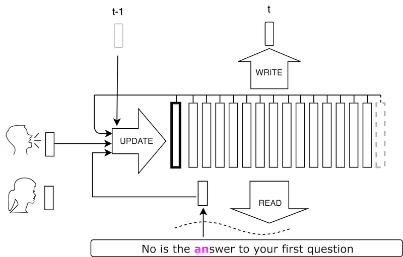
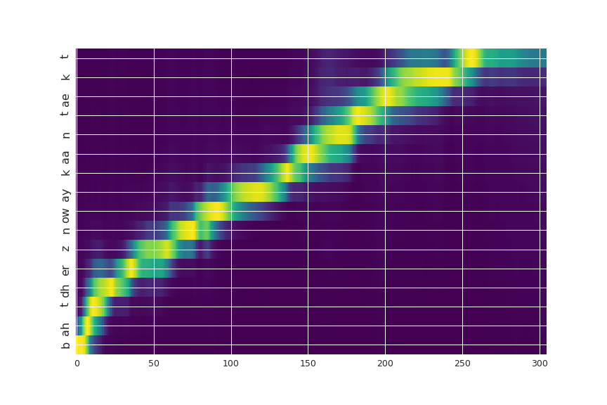
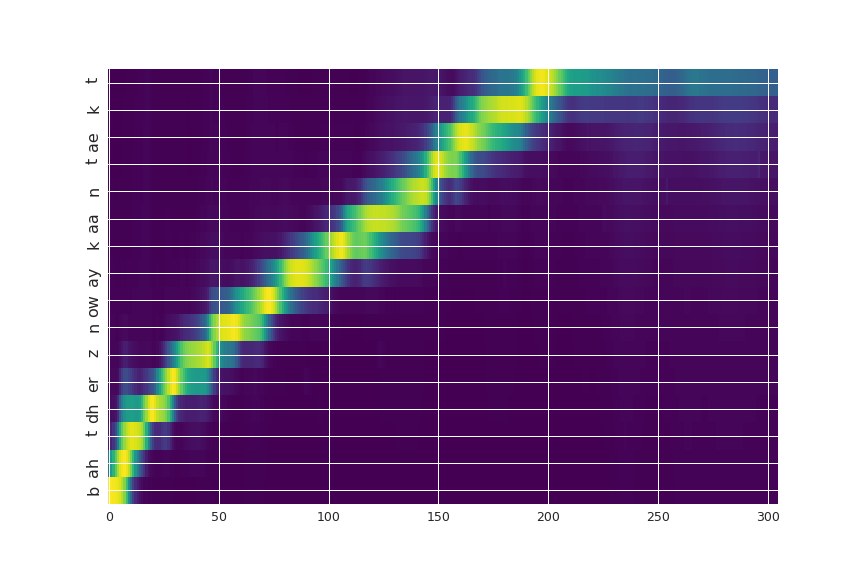

# VoiceLoop
PyTorch implementation of the method described in the paper [VoiceLoop: Voice Fitting and Synthesis via a Phonological Loop](https://arxiv.org/abs/1707.06588).

<p align="center"></p>

VoiceLoop is a neural text-to-speech (TTS) that is able to transform text to speech in voices that are sampled
in the wild. Some demo samples can be [found here](https://ytaigman.github.io/loop/site/).

## Quick Links
- [Demo Samples](https://ytaigman.github.io/loop/site/) 
- [Quick Start](#quick-start)
- [Setup](#setup)
- [Training](#training)

## Quick Start
Follow the instructions in [Setup](#setup) and then simply execute:
 ```bash
 python generate.py  --npz data/vctk/numpy_features_valid/p318_212.npz --spkr 13 --checkpoint models/vctk/bestmodel.pth
 ```
 Results will be placed in ```models/vctk/results```. It will generate 2 samples: 
  * The [generated sample](https://ytaigman.github.io/loop/demos/vctk_tutorial/p318_212.gen_10.wav) will be saved with the gen_10.wav extension.
  * Its [ground-truth (test) sample](https://ytaigman.github.io/loop/demos/vctk_tutorial/p318_212.orig.wav) is also generated and is saved with the orig.wav extension.
  
You can also generate the same text but with a different speaker, specifically:
 ```bash
 python generate.py  --npz data/vctk/numpy_features_valid/p318_212.npz --spkr 18 --checkpoint models/vctk/bestmodel.pth
 ```
Which will generate the following [sample](https://ytaigman.github.io/loop/demos/vctk_tutorial/p318_212.gen_14.wav). 

Here is the corresponding attention plot: 

<p align="center"></p>

Legend: X-axis is output time (acoustic samples) Y-axis is input (text/phonemes). Left figure is speaker 10, right is speaker 14. 

Finally, free text is also supported:
 ```bash
python generate.py  --text "hello world" --spkr 1 --checkpoint models/vctk/bestmodel.pth
```

## Setup
Requirements: Linux/OSX, Python2.7 and [PyTorch 0.1.12](http://pytorch.org/). Generation requires installing [phonemizer](https://github.com/bootphon/phonemizer), follow the setup instructions there. 
The current version of the code requires CUDA support for training. Generation can be done on the CPU.

```bash
git clone https://github.com/facebookresearch/loop.git
cd loop
pip install -r scripts/requirements.txt
```

### Data
The data used to train the models in the paper can be downloaded via:
```bash
bash scripts/download_data.sh
```

The script downloads and preprocesses a subset of [VCTK](http://homepages.inf.ed.ac.uk/jyamagis/page3/page58/page58.html). This subset contains speakers with american accent.  

The dataset was preprocessed using [Merlin](http://www.cstr.ed.ac.uk/projects/merlin/) - from each audio clip we extracted vocoder features using the [WORLD](http://ml.cs.yamanashi.ac.jp/world/english/) vocoder. After downloading, the dataset will be located under subfolder ```data``` as follows:

```
loop
├── data
    └── vctk
        ├── norm_info
        │   ├── norm.dat
        ├── numpy_feautres
        │   ├── p294_001.npz
        │   ├── p294_002.npz
        │   └── ...
        └── numpy_features_valid
```

The preprocess pipeline can be executed using the following script by Kyle Kastner: https://gist.github.com/kastnerkyle/cc0ac48d34860c5bb3f9112f4d9a0300.

### Pretrained Models
Pretrainde models can be downloaded via:
```bash
bash scripts/download_models.sh
```
After downloading, the models will be located under subfolder ```models``` as follows:

```
loop
├── data
├── models
    ├── blizzard
    ├── vctk
    │   ├── args.pth
    │   └── bestmodel.pth
    └── vctk_alt
```

**Update 10/25/2017:** Single speaker model available in models/blizzard/

### SPTK and WORLD
Finally, speech generation requires [SPTK3.9](http://sp-tk.sourceforge.net/) and [WORLD](http://ml.cs.yamanashi.ac.jp/world/english/) vocoder as done in Merlin. To download the executables: 
```bash
bash scripts/download_tools.sh
```
Which results the following sub directories:
```
loop
├── data
├── models
├── tools
    ├── SPTK-3.9
    └── WORLD
```
 
## Training

### Single-Speaker
Single speaker model is trained on [blizzard 2011](http://www.cstr.ed.ac.uk/projects/blizzard/2011/lessac_blizzard2011/). Data should be downloaded and prepared as described above. Once the data is ready, run:
```bash
python train.py --noise 1 --expName blizzard_init --seq-len 1600 --max-seq-len 1600 --data data/blizzard --nspk 1 --lr 1e-5 --epochs 10
```
Then, continue training the model with :
```bash
python train.py --noise 1 --expName blizzard --seq-len 1600 --max-seq-len 1600 --data data/blizzard --nspk 1 --lr 1e-4 --checkpoint checkpoints/blizzard_init/bestmodel.pth --epochs 90
```
### Multi-Speaker
Training a new model on vctk, first train the model using noise level of 4 and input sequence length of 100:
```bash
python train.py --expName vctk --data data/vctk --noise 4 --seq-len 100 --epochs 90
```
Then, continue training the model using noise level of 2, on full sequences:
```bash
python train.py --expName vctk_noise_2 --data data/vctk --checkpoint checkpoints/vctk/bestmodel.pth --noise 2 --seq-len 1000 --epochs 90
```

## Citation
If you find this code useful in your research then please cite:

```
@article{taigman2017voice,
  title           = {VoiceLoop: Voice Fitting and Synthesis via a Phonological Loop},
  author          = {Taigman, Yaniv and Wolf, Lior and Polyak, Adam and Nachmani, Eliya},
  journal         = {ArXiv e-prints},
  archivePrefix   = "arXiv",
  eprinttype      = {arxiv},
  eprint          = {1705.03122},
  primaryClass    = "cs.CL",
  year            = {2017}
  month           = October,
}
```

## License
Loop has a CC-BY-NC license.
